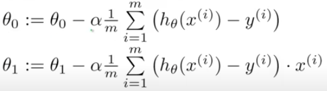
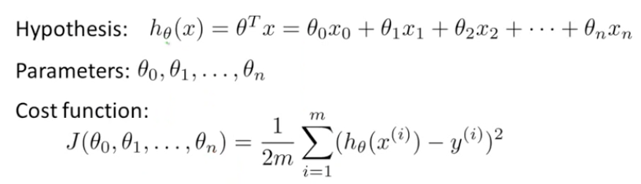
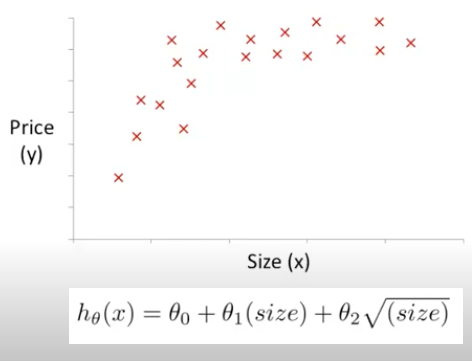
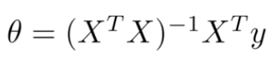
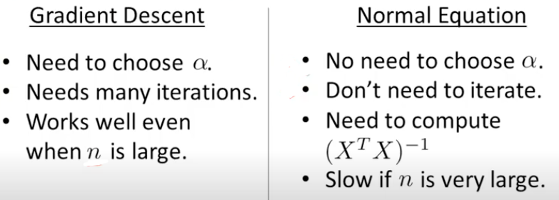
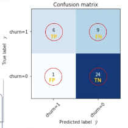
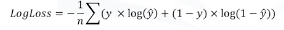

# Machine Learning Doc

## Unsupervised vs Supervised
- Supervised Learning: Maps an input to an output based on example input-output pairs
- Unsupervised Learning: Task for looking for patterns in data (clustering or separating data)

---------------------------
---------------------------
---------------------------
## Regression Algorithms
- Ordinal Regression
- Poisson Regression
- Fast forest quantile Regression
- Linear, Polynomial, Lasso, Stepwise, Ridge Regression
- Bayesian linear Regression
- Neural network Regression
- Decision forest Regression
- Boosted decision tree Regression
- KNN (K-nearest neighbors)

---------------------------
---------------------------
---------------------------
## Linear Regression Algorithm (One Variable)
- Training Set -> Learning Algorithm -> (x-values -> hypothesis function -> estimated y-values)
- Minimize Y-intercept and Slope = Cost Function (Squared Error Cost Function)
- **Regression is continuous output**

### Gradient Descent Algorithm (Minimizes Cost Function J)
- From an arbitrary point, taking steps until converge at local minumum
- Repeat algorithm until convergence and update y-intercept and slope

- Has learning rate (alpha) and derivative of J (these values subtract or add to slope and y-intercept)
- **Positive Derivative decreases theta and Negative Derivative increases theta**
- Repeat until derivative becomes 0 and theta == theta

- Batch Gradient Descent - every step uses all training examples
- **Linear Regression with gradient descent simplified:**

---------------------------
---------------------------
---------------------------
## Linear Regression Algorithm (Multivariate)
- Mutiple features (x1, x2, x3) (n)
- Hypothesis includes multitple components

### Gradient Descent Algorithm For Multiple Variables
- Multiple features to constantly update 

#### Implementing Gradient Descent Well: Feature Scaling
- Features should have similar ranges of values (0-2000) and (0-5)
- Scaling would make countrous of cost function more circular -> gradient decsent takes direct path to global minimum (size/2000) and (# of rooms/5)
- Each feature have range: -1 <= x <= 1 (Close enough to this range should have efficient algorithm), (not too small or not too large)
- #### Mean Normalization
    - Take average: (testSize - avgSize) / (maxSize - minSize)
    - avgSize = average value of x in training set

#### Implementing Gradient Descent Well: Learning Rate (choosing 𝛼)
- Make sure gradient descent is working well
- Plot # iterations vs cost function -> should decrease and converge to a value
- Convergence if J(θ) decreases less than 10^-3
- **J(θ) increasing -> smaller 𝜶**
- **J(θ) a parabola, -> overshoots if bigger 𝛼**
- **J(θ) slow to converge -> 𝛼 too small**

### Polynomial Regression
- Use powers and roots in features to fit curve that models data

### Normal Equation Non Invertibilty
- Using normal function to find value of θ without gradient descent: 

- **Matrices that do not have inverses: degenerate or non-invertible**
- if (X^T X == non-invertible) -> **simplify features (redundant features)** or **delete some features (regularization)**
- Inverse of matrix in octave: "pinv()"

### Gradient Descent vs Normal Equation
- **Gradient Descent** -> taking steps to minimze J(θ) and find the global minumum θ
- **Normal Equation** -> Solve for optimal value θ
- To get normal equation, solve for each feature in J(θ)
- Normal Equation does not need Feature Scaling
- When to use and not use both methods:

---------------------------
---------------------------
---------------------------
## Classification

### Evaluation Metrics: Classfication
- Jacard Index (Best value at 1)
    - J = (correctYPredictions) / (realElements + predictedElements - correctYPredictions)
- F1 Score (Best value at 1)
    - Confusion Matrix shows chart with correct and wrong predictions
    - Precision = TruePositive / (TruePositive + FalsePositive)
    - Recall = TruePositive / (TruePositive + FalseNegative)
    - F1 Score = 2*(prec * rec)/(prec + rec)

- Log loss (Best value or higher accuracy at 0)
    - Predicted output is a probability value between 0 and 1
    - Log Loss Equation: 

### Classification Algorithms
- Decision Trees
    - Testing attributes or features: internal nodes are tests, branches are results of the test, and leaf node assigns patients to a class
    - Attributes should split data so that there is less impurity
    - Aiming for a pure node and impurity should go down as the tree grows -> less entropy
- Naive Bayes
- Linear Discriminant Analysis
- k-Nearest Neighbor - classifying cases based on their similarity to other cases
    - On a scatter plot, the closest case can be associated to the unknown case that the algorithm is predicting
    - Choosing 5 nearest neighbors and taking majority is more reliable
    - k = amount of cases nearest to the unkown case
    - Calculate the distant between cases using distance formula
- Logistic Regression
- Neural Networks
- Support Vector Machines 

