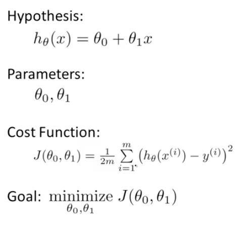
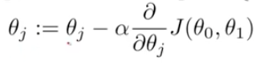
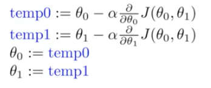

# Machine Learning Documentation

## Unsupervised vs Supervised
- Supervised Learning: Maps an input to an output based on example input-output pairs
- Unsupervised Learning: Task for looking for patterns in data (clustering or separating data)

## Linear Regression Algorithm
- Training Set -> Learning Algorithm -> (x-values -> hypothesis function -> estimated y-values)
- Minimize Y-intercept and Slope = Cost Function (Squared Error Cost Function)
- **Regression is continuous output**

### Gradient Descent Algorithm (Minimizes Cost Function J)
- From an arbitrary point, taking steps until converge at local minumum
- Repeat algorithm until convergence and update y-intercept and slope

- Has learning rate (alpha) and derivative of J (these values subtract or add to slope and y-intercept)
- **Positive Derivative decreases theta and Negative Derivative increases theta**
- Repeat until derivative becomes 0 and theta == theta

