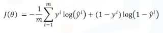
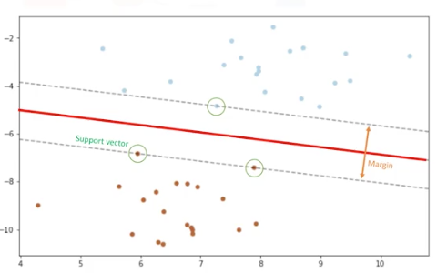
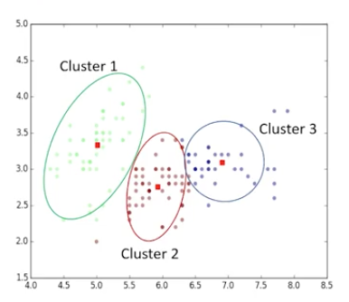
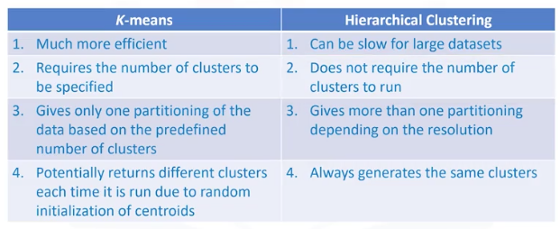

# Machine Learning Documentation
---------------------------
## Regression Algorithms
- Ordinal Regression
- Poisson Regression
- Fast forest quantile Regression
- Linear, Polynomial, Lasso, Stepwise, Ridge Regression
- Bayesian linear Regression
- Neural network Regression
- Decision forest Regression
- Boosted decision tree Regression
- KNN (K-nearest neighbors)
---------------------------
## Classification
### Evaluation Metrics: Classification
- **Jaccard Index (Best value at 1)**
    - J = (correctYPredictions) / (realElements + predictedElements - correctYPredictions)
- **F1 Score (Best value at 1)**
    - Confusion Matrix shows chart with correct and wrong predictions
    - Precision = TruePositive / (TruePositive + FalsePositive)
    - Recall = TruePositive / (TruePositive + FalseNegative)
    - F1 Score = 2*(prec * rec)/(prec + rec)

- **Log loss (Best value or higher accuracy at 0)**
    - Predicted output is a probability value between 0 and 1
    - Log Loss Equation: 

### Classification Algorithms
- **Decision Trees**
    - Testing attributes or features: internal nodes are tests, branches are results of the test, and leaf node assigns patients to a class
    - Attributes should split data so that there is less impurity
    - Aiming for a pure node and impurity should go down as the tree grows -> less entropy
- **Naive Bayes**
- **Linear Discriminant Analysis**
- **k-Nearest Neighbor** - classifying cases based on their similarity to other cases
    - On a scatter plot, the closest case can be associated to the unknown case that the algorithm is predicting
    - Choosing 5 nearest neighbors and taking majority is more reliable
    - k = amount of cases nearest to the unknown case
    - Calculate the distant between cases using distance formula
- **Logistic Regression**
    - Binary classification: 0 or 1
    - Returns a probability score between 0 and 1
    - Sigmoid Function = Logistic Function -> bigger then 1, smaller then 0
    - Training Process: 1) Initialize theta 2) Calculate y_hat 3) Find error (real - predict) 4) Change theta to reduce cost function 5) Go to 2 and start again (Use gradient descent to reduce cost and accuracy to stop interaction)
    - Logistic Regression Cost Function 

    - To get parameters need to minimize the cost function using gradient descent
- **Neural Networks**
- **Support Vector Machines** - supervised algorithm that classifies cases by finding a separator
    - SVM outputs a hyperplane that separates cases and be used to classify unknown cases
    - Data transformation - changing data to separate data -> Kernel Functions (linear, polynomial, RBF, and Sigmoid)
    - Finding the Hyperplane with support vectors closes to the margin lines: 

    - Advantage: accurate in high dimension places and memory efficient
    - Disadvantage: prone to over-fitting, no probability estimation, small datasets
    - Applications: Image Recognition, Text Category, Detecting Spam, Sentiment Analysis, Gene Expression Classification, and other machine learning techniques
---------------------------
## Clustering
- Cluster -> a group of objects that are similar to other objects in that cluster and dissimilar to data points in other clusters 

- Form of unsupervised learning
- Applications: Exploratory Data Analysis, Summary Generation, Outlier Detection, Finding Duplicates, Pre-processing Step

### Clustering Algorithms
- Partitioned-based Clustering (Relatively Efficient and forms sphere-like clusters) (For Medium and Large Databases)
    - **k-Means** (unsupervised)
        - Divides data into non-overlapping subsets
        - k = number of clusters (choose random centroids of clusters)
        - Reduce error: SSE = sum of squared differences between each point and its centroid
        - Compute new centroids of clusters by taking mean of data points
        - Repeat process of new centroids and calculating distance between points and centroid until converges and centroid does not move
        - *Accuracy*
            - External -> compare with ground truth if available
            - Internal -> Average the distance between data points within a cluster
            - Choosing k -> graph of k vs mean distance of data points to cluster centroid (best when distance is low) __Find elbow point of graph or where the rate decreases sharply for best k__
    - **k-Median**
    - **Fuzzy c-Means**
- Hierarchical Clustering (Intuitive and good for small datasets) -> builds hierarchy of clusters where each node is a cluster and consists of the clusters of its daughter nodes
    - **Agglomerative** (collect things)
        - Bottom up or where pairs of clusters pair together
        - Steps: *1)* Create n clusters for each data point *2)* Compute the proximity matrix *3)* Repeat -> Merge two closest clusters and update the proximity matrix -> Until only single cluster remains
        - *Single-Linkage Clustering*
            - Minimum distance between clusters
        - *Complete-Linkage Clustering*
            - Maximum distance between clusters
        - *Average Linkage Clustering*
            - Average distance between clusters
        - *Centroid Linkage Clustering*
            - Distance between cluster centroids
    - **Divisive**
        - Top Down or dividing the clusters
    - Partitioned-Based (k-Means) vs Hierarchical Clustering: 

- Density-based Clustering (Produces arbitrary shaped clusters) (Good when spacial clusters or when noise in dataset)
    - **DBSCAN** (Density-Based Spatial Clustering of Applications with Noise)
        - Common clustering algorithm and works based on density of objects
        - Parameters
            - R (Radius of neighborhood) = if includes enough number of points within then it is a dense area
            - M (Min number of neighbors) = minimum number of data points that we want in a neighborhood to define a cluster
        - Core Points -> data points that have the M points and are at the center
        - Border Points -> data points that do not have the minimum number of points in a neighborhood
        - Clusters formed with at least one core point and can be connected by multiple core points
---------------------------
## Recommender Systems
- Captures the patter of people's behavior and use it to predict things they want or like
- **Content-Based**
    - Figures out favorite aspects and makes recommendations to show things that share those aspects
    - Take the rating and develop a matrix with the genre matrix and multiply to get a weighted matrix
- **Collaborative Filtering**
    - Find similar groups of users and shows recommendations based on what similar users might like
    - *User-Based*
        - Based on users' neighborhood
        - Have a User Rating Matrix and then learn the similarity weights
        - Create the weighted ratings matrix 
    - *Item-Based*
        - Based on items' similarity
        - Not based on content, but based on similarity between items 
    - Challenges
        - Data Sparsity
            - Users in general rate only a limited number of items
        - Cold Start
            - Recommendation to new users or new items
        - Scalability
            - Increase in number of users of items
- *Implementing Recommender System*
    - Memory-Based
        - Uses entire user-item dataset to generate recommendation
        - Uses statistical techniques
    - Model-Based
        - Develop model of user to attempt to learn their preference
        - Uses machine learning techniques